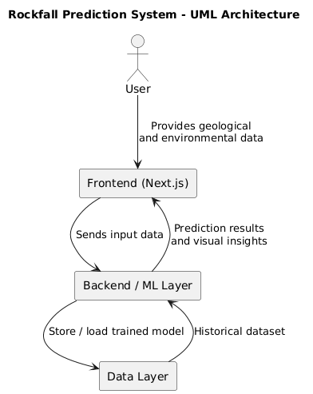

# Rockfall Prediction System

## Overview
This project is a **machine learning–based rockfall prediction system** with a **Next.js frontend** for interaction and visualization. It predicts rockfall occurrence using geological and environmental data and demonstrates how machine learning can support **geohazard risk assessment and infrastructure safety**.

The system follows an end-to-end workflow combining data preprocessing, model training, evaluation, and a web-based interface.

---

## Problem Statement
Rockfall events are influenced by complex geological and environmental factors and pose serious risks to infrastructure and human safety. Traditional analysis methods can be limited in scalability and efficiency.

This project explores how **machine learning models** can identify patterns in historical data and assist in predicting rockfall occurrence in a structured and scalable manner.

---

## Tech Stack

### Frontend
- Next.js
- React
- JavaScript
- HTML, CSS

### Backend / Machine Learning
- Python
- Scikit-learn
- Pandas
- NumPy
- Matplotlib

### Tools
- Jupyter Notebook
- Node.js
- npm / yarn

---

## System Workflow
1. Geological and environmental data is preprocessed and analyzed
2. A machine learning classification model is trained and evaluated
3. The trained model generates rockfall predictions
4. The Next.js frontend displays prediction results and insights

---

## Machine Learning Approach

### Data Preprocessing
- Handled missing values and inconsistent data
- Performed feature scaling and exploratory data analysis
- Analyzed correlations between geological and environmental features

### Model Training & Evaluation
- Trained a classification model using Scikit-learn
- Evaluated performance using accuracy, precision, recall, and F1-score
- Achieved approximately **84% prediction accuracy** on test data
- Visualized results to support hazard risk assessment

---
### Architecture Diagram

<p align="center">
  
</p>


## Frontend Setup (Next.js)

### Prerequisites
Ensure the following are installed:
- Node.js (v16 or above recommended)
- npm or yarn

Check installation:
```bash
node -v
npm -v

